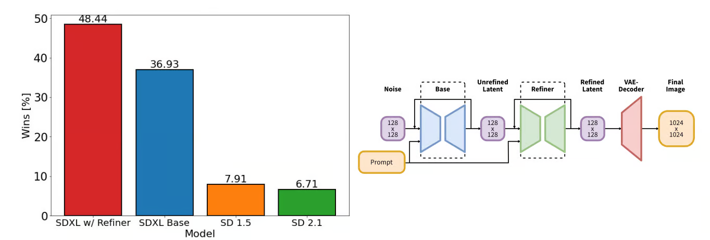

# Fine-Tuning-Stable-Diffusion-with-LoRA

we will learn about Stable Diffusion XL and LoRA, and how to access the image generation model using the diffuser library. 

### Understanding Stable Diffusion XL
The Stability AI team has released Stable Diffusion XL (SDXL) 1.0, representing the next evolution in AI text-to-image generation models. This open-source model builds on the previous research-only SDXL 0.9 model to become the world's most capable publicly available image creation model.

Both quantitative analysis and qualitative human evaluations over weeks of experimentation demonstrate SDXL's capabilities to generate the highest quality and most preferred images compared to other open-source models.

This high quality was achieved by using an ensemble of two models - a 3.5 billion parameter base generator and a 6.6 billion parameter refiner. This dual pipeline maximizes image quality while remaining efficient enough to run on consumer GPUs.

Now, with SDXL 1.0, users no longer need long, complex prompts to generate stunning images. Its intelligence allows the creation of intricate images from just a few words.

Fine-tuning SDXL on custom datasets and tasks has become even easier. It allows us granular control over structure, style, and composition.

### LoRA (Low-Rank Adaptation)

A technique used in machine learning, particularly in fine-tuning large language models or other neural networks. LoRA significantly reduces the computational cost and memory requirements of training by adapting only a small subset of the model's weights in a structured and efficient way.

---

### How LoRA Works
   - Instead of fine-tuning the entire set of model weights, LoRA introduces a low-rank decomposition into the weight update process. 
   - It adds small, trainable matrices to the layers of the model, which are used to learn task-specific adjustments while keeping the original model weights frozen.

---

### Benefits of LoRA

1. **Parameter Efficiency**:
   - LoRA drastically reduces the number of parameters that need to be updated, making fine-tuning feasible even for very large models.

2. **Reduced Resource Requirements**:
   - By freezing the original model weights, LoRA avoids the need to store or compute gradients for all parameters.

3. **Task-Specific Adaptation**:
   - LoRA enables task-specific adaptations without overwriting or losing the original pre-trained knowledge of the model.

4. **Easy Integration**:
   - LoRA can be implemented as an additional module and does not require changing the architecture of the original model.

---

### Use Cases of LoRA

1. **Fine-Tuning Large Models**:
   - It is widely used in large language models (e.g., GPT, BERT) to fine-tune them on specific tasks such as classification, summarization, or generation.

2. **Multi-Task Learning**:
   - LoRA can be used to fine-tune a single model for multiple tasks by maintaining separate low-rank matrices for each task.

3. **Stable Diffusion & Image Models**:
   - LoRA is applied in generative models like Stable Diffusion to train them on custom datasets (e.g., specific art styles or domains).

---

### Why LoRA is Popular
LoRA has become particularly popular for working with large-scale models like GPT and Stable Diffusion because it:
- Enables cost-effective fine-tuning.
- Supports resource-constrained environments.
- Allows users to adapt large models to specific domains or tasks without significant computational overhead.

It’s widely used in AI applications, from NLP to computer vision and generative art.
